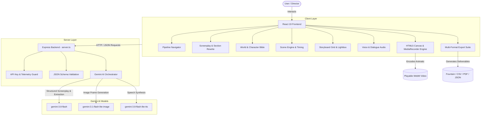

# SceneCraft

> **Turn an idea into a complete, structured content production pipeline.**

[](tests/)
[](tsconfig.json)
[](package.json)
[](LICENSE)

---

## Live Demo

- **Application URL**: [https://ais-dev-kkxb7ks27a5svkbrvivdvi-968640885885.asia-southeast1.run.app](https://ais-dev-kkxb7ks27a5svkbrvivdvi-968640885885.asia-southeast1.run.app)
- **Pre-Loaded Demo**: Explore the pre-loaded short film project *"The Last Signal"* without requiring an API key.

---

## Overview

Modern generative AI tools often treat content generation as disconnected chat prompts. A writer gets a script in one tab, copies snippets into an image generator in another tab where characters change face and clothing every frame, and is left with no coherent way to organize scenes, record voiceovers, or generate an animatic pitch.

**SceneCraft** solves this by establishing a disciplined, sequential **8-stage production pipeline**:

```
Idea → Project Config → Screenplay → World Bible → Scenes → Storyboard → Voice Audio → Video Assembly → Export
```

Every stage produces validated, structured data that directly feeds the next step, ensuring that character traits, recurring environments, camera directions, and timing remain consistent.

---

## System Architecture



---

## The 8 Pipeline Stages

| Stage | Name | Key Functionality |
| :--- | :--- | :--- |
| **01** | **Project Setup** | Configure title, premise, format (Short Film, YouTube, Ad, Animation), duration, tone, and visual style. |
| **02** | **Screenplay** | Generates title, logline, synopsis, and full screenplay with scene headers. Supports selective single-section rewrites. |
| **03** | **World Bible** | Extracts characters, recurring locations, and props. Stores visual prompt markers for cross-scene consistency. |
| **04** | **Scene Engine** | Breaks down screenplay into sequential scenes with camera directions, actions, dialogue, mood, and durations. Reorder scenes with automatic renumbering. |
| **05** | **Storyboard** | Multi-state visual grid (`idle`, `generating`, `completed`, `failed`). Generates frames with Gemini Image models, includes lightbox inspector and single-frame downloads. |
| **06** | **Voice Audio** | Optional voiceover & dialogue speech synthesis with 5 prebuilt Gemini TTS voices (Kore, Puck, Charon, Fenrir, Zephyr). Non-blocking. |
| **07** | **Video Assembly** | Real-time animatic player with Ken Burns movement and audio sync. Browser-side Canvas `MediaRecorder` compiles genuine `.webm` video files. |
| **08** | **Export Suite** | Fountain (`.fountain`), Markdown (`.md`), Plain Text, CSV scene breakdowns, printable PDF-ready storyboard, and full project backup JSON. |

---

## Tech Stack

- **Frontend**: React 19, TypeScript, Tailwind CSS, Lucide Icons, Vite
- **Backend / Server**: Node.js, Express, tsx
- **AI Models & SDK**: Official `@google/genai` TypeScript SDK
  - **Text & Extraction**: `gemini-3.8-flash`
  - **Image Generation**: `gemini-3.1-flash-lite-image`
  - **Speech Synthesis**: `gemini-3.8-flash-lite-tts`
- **Video Assembly**: HTML5 Canvas 2D, MediaStream Recording API (`MediaRecorder`), Web Audio API
- **Testing**: Node.js Native Test Runner (`node:test`, `node:assert/strict`)

---

## Getting Started

### Prerequisites
- Node.js `v20.x` or higher (`v22.x` recommended)
- npm `v10.x` or higher

### Installation

1. **Clone the repository**:
   ```bash
   git clone https://github.com/Pradyut-S1n5h/AI-Content-Pipeline-Re-coded.git
   cd AI-Content-Pipeline-Re-coded
   ```

2. **Install dependencies**:
   ```bash
   npm install
   ```

3. **Configure Environment Variables**:
   Copy the example environment file:
   ```bash
   cp .env.example .env
   ```
   Open `.env` and set your Gemini API key:
   ```env
   GEMINI_API_KEY="your-gemini-api-key"
   ```
   *(Note: If you run without an API key, SceneCraft will automatically run in Demo Mode with the complete "The Last Signal" project pre-loaded).*

4. **Start the Development Server**:
   ```bash
   npm run dev
   ```
   Open your browser at `http://localhost:3000`.

---

## Running Tests & Verification

SceneCraft includes automated tests covering data integrity, prompt construction, character consistency, schema validators, scene ordering, and export generation:

```bash
# Run unit test suite
npm test

# Run TypeScript linter
npm run lint

# Build for production
npm run build
```

---

## Environment Variables

| Variable | Required | Description |
| :--- | :--- | :--- |
| `GEMINI_API_KEY` | Optional | Google Gemini API key used on the server for live AI generation. If omitted, the app runs in Demo Mode. |
| `PORT` | Optional | Port for the full-stack Express server (defaults to `3000`). |

> **Security Note**: `GEMINI_API_KEY` is strictly accessed server-side in `server.ts`. It is never bundled into client-side JavaScript or sent to the browser.

---

## Project Structure

```
├── server.ts                  # Express backend proxying Gemini AI calls securely
├── src/
│   ├── types/index.ts         # Canonical TypeScript interfaces (Project, Scene, WorldBible, etc.)
│   ├── services/
│   │   ├── api.ts             # Client API client calling Express backend
│   │   └── storage.ts         # Local persistence layer with autosave
│   ├── utils/
│   │   ├── promptBuilder.ts   # Consistency engine weaving World Bible into scene prompts
│   │   ├── videoRenderer.ts   # HTML5 Canvas + MediaRecorder video assembly engine
│   │   ├── exportUtils.ts     # Fountain, Markdown, CSV, and Printable Storyboard generators
│   │   └── sampleData.ts      # Pre-loaded "The Last Signal" short film demo project
│   ├── components/
│   │   ├── Header.tsx         # Workspace header, project switcher, save status indicator
│   │   ├── PipelineNav.tsx    # Sequential pipeline navigation bar
│   │   ├── ProjectModal.tsx   # Project configuration & settings modal
│   │   └── stages/
│   │       ├── ProjectOverview.tsx # Stage 01: Project overview & pipeline status
│   │       ├── ScriptStage.tsx     # Stage 02: Screenplay writer & section rewrite
│   │       ├── WorldBibleStage.tsx # Stage 03: World & Character Bible
│   │       ├── SceneStage.tsx      # Stage 04: Scene Engine & timing
│   │       ├── StoryboardStage.tsx # Stage 05: Visual Storyboard & image generator
│   │       ├── AudioStage.tsx      # Stage 06: Voice & speech synthesis studio
│   │       ├── VideoStage.tsx      # Stage 07: Video timeline & animatic assembler
│   │       └── ExportStage.tsx     # Stage 08: Export suite & archive manager
│   ├── App.tsx                # Master workspace coordinator
│   └── main.tsx               # Client entry point
├── tests/
│   └── pipeline.test.ts       # Automated unit test suite (node:test)
├── docs/
│   ├── architecture.md        # Technical architecture & design rationale
│   ├── pipeline.md            # Detailed pipeline stage specifications
│   ├── api.md                 # API endpoints & request/response schemas
│   └── PORTFOLIO.md           # Portfolio study, challenges, & solutions
├── CHANGELOG.md               # Version history
├── CONTRIBUTING.md            # Contribution guidelines
├── LICENSE                    # MIT License
└── package.json               # Dependencies & scripts
```

---

## Known Limitations

- **Image Generation Quota**: Live image generation requires a Gemini API key with access to `gemini-3.1-flash-lite-image`. A fallback sample art mode is provided for offline/demo use.
- **Video Format**: Current in-browser video rendering exports WebM video files (`video/webm`). MP4 transcoding requires WebAssembly FFmpeg.
- **Audio Models**: Multi-speaker backchanneling (`gemini-3.8-flash-tts`) is documented in architecture for future expansion; single-speaker narration is currently implemented with `gemini-3.8-flash-lite-tts`.

---

## Roadmap

- [ ] WebAssembly FFmpeg client-side transcoding to MP4 format.
- [ ] Multi-speaker dialogue generation with scripted vocal bursts and backchanneling.
- [ ] Google Veo video generation integration (`veo-3.1-lite-generate-preview`) for motion clips.
- [ ] Cloud workspace synchronization via PostgreSQL.

---

## License

This project is licensed under the [MIT License](LICENSE).
